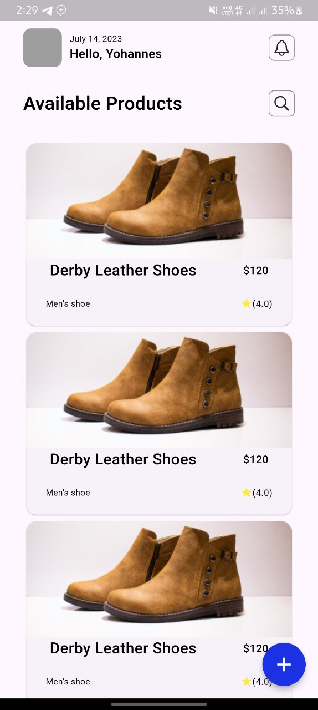
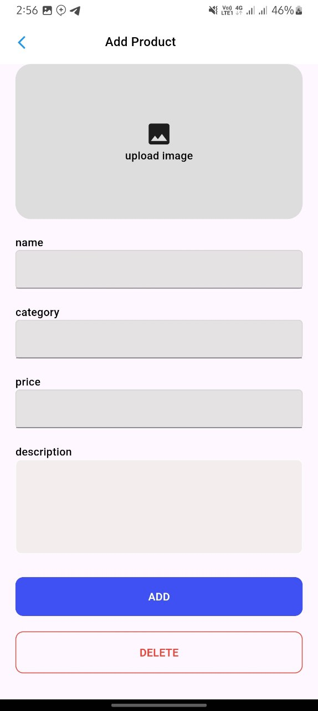
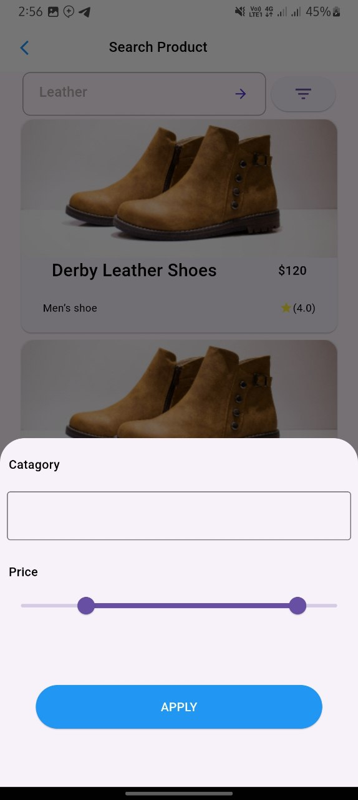
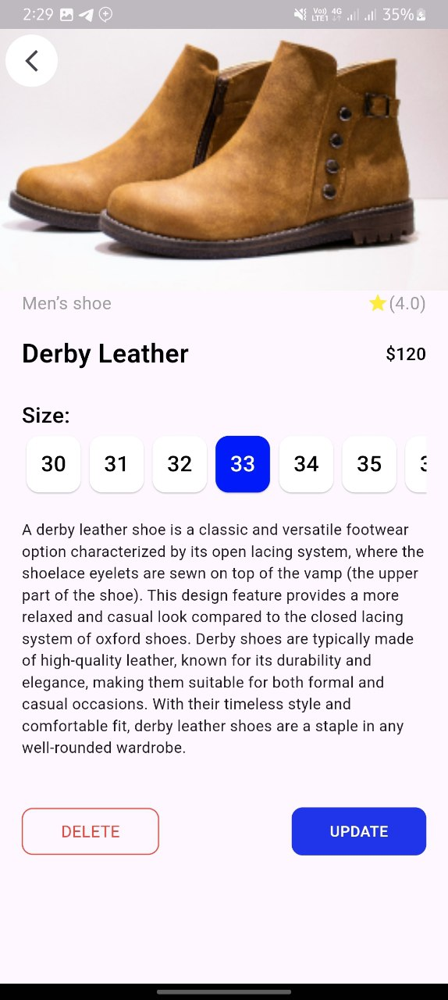
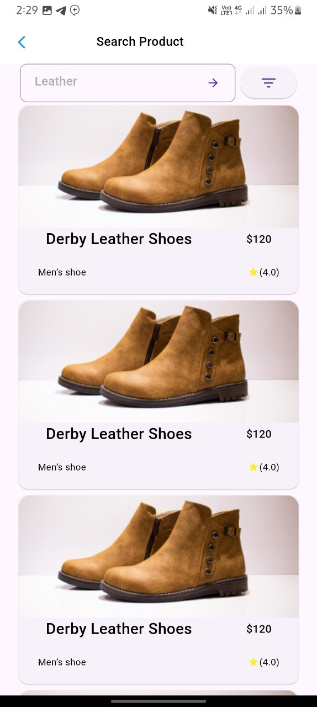

# Flutter Application Documentation

## Table of Contents
- [Project Overview](#project-overview)
- [Requirements](#requirements)
- [Architecture](#architecture)
  - [Clean Architecture](#clean-architecture)
    - [Layers](#layers)
- [Data Flow](#data-flow)
- [Project Structure](#project-structure)
  - [Main Directory Structure](#main-directory-structure)
  - [Testing Directory Structure](#testing-directory-structure)
- [Implementation Details](#implementation-details)
  - [Design Replication](#design-replication)
  - [Widgets and Components](#widgets-and-components)
- [Test Driven Development (TDD)](#test-driven-development-tdd)
- [Task Verification](#task-verification)
- [Dependencies](#dependencies)
- [Conclusion](#conclusion)

## Project Overview

This project is part of an internship at A2SV, focusing on learning Flutter development using Test Driven Development (TDD), Clean Architecture, and BLoC (Business Logic Component) pattern. The application aims to demonstrate these principles through practical implementation while replicating a given design.

## Requirements

- **Flutter SDK**: Ensure that you have Flutter SDK installed. Follow the installation guide [here](https://flutter.dev/docs/get-started/install).
- **Dependencies**: The project uses standard Flutter dependencies. Run `flutter pub get` to install them.

## Architecture

### Clean Architecture

Clean Architecture divides the project into multiple layers, each with a specific responsibility. This separation of concerns improves code maintainability, scalability, and testability.

#### Layers

1. **Presentation Layer**:
   - **Widgets**: UI components of the application.
   - **BLoC (Business Logic Component)**: Manages the state of the application and interacts with the use cases. It receives events from the UI, processes them, and emits new states.

2. **Domain Layer**:
   - **Entities**: Core classes of the application representing business objects.
   - **Use Cases**: Business logic implementation, coordinating the flow of data from the Repository to the BLoC.

3. **Data Layer**:
   - **Repositories**: Abstract classes defining the operations for data handling.
   - **Data Sources**: Concrete implementations for data handling, e.g., local database or remote API.

## Data Flow

1. **User Interaction**: User interacts with the UI (Presentation Layer).
2. **Event Triggering**: UI triggers an event which is sent to the BLoC.
3. **BLoC Processing**: BLoC receives the event and interacts with the Use Case.
4. **Use Case Execution**: The Use Case fetches/updates data from/to the Repository.
5. **Data Source Interaction**: Repository interacts with Data Sources to perform actual data operations.
6. **State Update**: Once data is fetched or updated, the Use Case returns the result to the BLoC.
7. **State Emission**: BLoC emits a new state based on the result, which the UI listens to and updates accordingly.

## Project Structure

### Main Directory Structure

lib/
├── core/
├── features/
│ ├── data/
│ │ ├── data_sources/
│ │ ├── models/
│ │ ├── repositories/
│ ├── domain/
│ │ ├── entities/
│ │ ├── use_cases/
│ │ ├── repositories/
│ ├── presentation/
│ │ ├── blocs/
│ │ ├── pages/
│ │ ├── widgets/
│ │ ├── ui/
│ │ │ ├── add_product/
│ │ │ ├── home/
│ │ │ ├── searchProduct/
├── main.dart

### Testing Directory Structure

test/
├── data/
│ ├── data_sources/
│ ├── models/
│ ├── repositories/
├── domain/
│ ├── entities/
│ ├── use_cases/
│ ├── repositories/
├── features/
├── helper/

## Implementation Details

### Design Replication

The user interface should closely match the design provided in the Figma link: [Figma Design Link](https://www.figma.com/design/957Md2CrZ2B9KGjHy8RDcH/Internship?node-id=0-1&t=Yrw4etwCj3Z4NKCI-0). Focus on:

- **Colors**: Match the color scheme as closely as possible.
- **Layout**: Ensure the layout and positioning of elements are consistent with the design.
- **Typography**: Use the specified fonts, sizes, and weights.
- **Design Elements**: Include any specific design elements such as buttons, icons, and images.

### Widgets and Components

Utilize Flutter widgets and components to build the UI:

- **Container**: For layout and styling.
- **Column & Row**: For arranging widgets vertically and horizontally.
- **Image**: To display images.
- **Text**: For displaying text.
- **Button**: For interactive elements.

## Test Driven Development (TDD)

Following TDD principles, the project is developed in a cycle of writing tests, implementing functionality, and refactoring code. Each layer (presentation, domain, data) has its own set of tests.

- **Unit Tests**: For testing individual components like use cases, repositories, and BLoC.
- **Widget Tests**: For testing UI components.
- **Integration Tests**: For testing the complete flow from UI to data sources.

## Task Verification

- **Project Naming**: Ensure the project is named correctly as specified.
- **Screenshots**:
  - 
  - 
  - 
  - 
  - 

## Dependencies

- **flutter_bloc**: For state management using BLoC pattern.
- **provider**: For dependency injection.
- **get_it**: For service locator pattern.
- **mockito**: For mocking dependencies in tests.
- **flutter_test**: For writing tests.

## Conclusion

This documentation provides a high-level overview of the architecture, data flow, and development practices used in this Flutter application. Following Clean Architecture and TDD ensures the project is robust, maintainable, and scalable. The use of BLoC for state management aligns with best practices in Flutter development, providing a reactive and testable approach to building applications.
